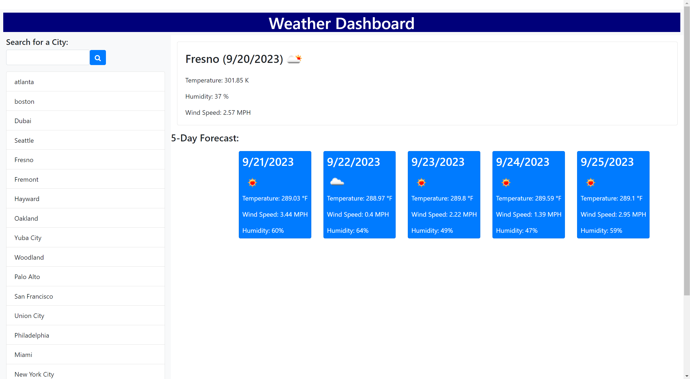

# ClimaCast-App

## User Story

```
AS A traveler
I WANT to see the weather outlook for multiple cities
SO THAT I can plan a trip accordingly
```

## Acceptance Criteria

```
GIVEN a weather dashboard with form inputs
WHEN I search for a city
THEN I am presented with current and future conditions for that city and that city is added to the search history
WHEN I view current weather conditions for that city
THEN I am presented with the city name, the date, an icon representation of weather conditions, the temperature, the humidity, and the wind speed
WHEN I view future weather conditions for that city
THEN I am presented with a 5-day forecast that displays the date, an icon representation of weather conditions, the temperature, the wind speed, and the humidity
WHEN I click on a city in the search history
THEN I am again presented with current and future conditions for that city
```

## Objective

Provided with the API link to a weather website (https://api.openweathermap.org/data/2.5/forecast?lat={lat}&lon={lon}&appid={API key}), using your own API key, create a functional weather website that will return the current weather once the user clicks submit on a form field for a specific entered city. Once the user enters submit, the page will also return the predicted forecast for the next five days, where all of the searches the user has done will be displayed onscreen based on the local storage.



## Link to Website

https://dcollan.github.io/fantastic-weather-app/

## How to Run

1) Run 'git clone (repo link)' on Git Bash'
2) CD into project directory
3) Run project via code editor (e.g. Visual Studio Code)
4) Navigate to index.html
5) Right click on file, and click 'Open in Default Browser' to view project in browser
